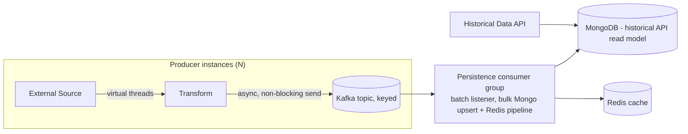

# Trading Data Pipeline Architecture — Spring Boot 4 / Java 21+

## Context

A set of Java + Spring Boot microservices in a trading system that:

1. Retrieve data from external sources (file, DB, external APIs).
2. Persist to MongoDB (historical records, queried via API).
3. Persist to Redis (cache).
4. Publish to Kafka using a key (to preserve per-key order).

Current pain points:

- Redis/DB persistence is done via a generic executor pool.
- Mongo writes are slow (~1 record/sec).
- Multiple instances of the service run concurrently.
- Debezium/Kafka Connect is not usable in this enterprise environment.
- Kafka — not MongoDB — is the system of record. Mongo/Redis exist only to serve
  a historical-records API; the primary service goal is low-latency passthrough
  to Kafka.

---

## 1. Guiding principles

- **Kafka is the source of truth.** Mongo and Redis are derived, rebuildable
  read-projections, not participants in a consistency-critical write.
- **The hot path is ingest → transform → publish.** Nothing else runs inline
  with message publishing.
- **No dual-write coordination needed.** Because projections are rebuildable
  from Kafka, consumer crashes/redelivery are self-healing as long as writes
  are idempotent.
- **Virtual threads replace bounded executor pools** for blocking I/O
  (file/DB/API reads); the Kafka producer itself is already non-blocking.
- **Batch and upsert** instead of per-record delete+insert for Mongo writes.

---

## 2. Target architecture



`C` lives in the same deployable as the producer — a single
`@KafkaListener` consumer group tailing the output topic and writing to
both Mongo and Redis in the same batch, giving CDC-like behavior without
Kafka Connect/Debezium and without a second consumer group per service
(see §8 for why this matters at fleet scale).

---

## 3. Passthrough producer — the only thing on the critical path

```java
@Bean
KafkaTemplate<String, byte[]> kafkaTemplate(ProducerFactory<String, byte[]> pf) {
    return new KafkaTemplate<>(pf);
}

void publish(String key, byte[] payload) {
    // fire-and-forget: never block the ingestion thread on the send future
    kafkaTemplate.send("trading-events", key, payload)
        .whenComplete((result, ex) -> {
            if (ex != null) log.error("publish failed key={}", key, ex);
        });
}
```

Notes:

- `KafkaProducer.send()` is already non-blocking (single background I/O
  thread) — don't wrap it in an executor, and never call `.get()`/`.join()`
  on the future in the request path.
- Use virtual threads only where I/O genuinely blocks: reading
  files/DB/external APIs. Enable globally with
  `spring.threads.virtual.enabled=true`, or explicitly:

```java
@Bean
AsyncTaskExecutor applicationTaskExecutor() {
    return new VirtualThreadTaskExecutor("ingest-");
}
```

- Don't pool virtual threads like platform threads — use
  `Executors.newVirtualThreadPerTaskExecutor()` for fan-out ingestion tasks,
  and a `Semaphore` if you need to cap concurrent calls to a rate-limited
  external API.
- Producer config: `enable.idempotence=true`, `acks=all` as a safe default
  (drop to `acks=1` only if measured latency needs it and occasional loss is
  acceptable — recall Kafka replay can't recover a message that was never
  durably written), tune `linger.ms`/`batch.size` for throughput.

---

## 4. Persistence consumer — bulk, batched, off the hot path

A single batch listener writes to both Mongo and Redis per batch instead of
running two separate consumer groups (see §8) — both writes are now cheap
batched operations, so there's little value in scaling them independently:

```java
@KafkaListener(
    topics = "trading-events",
    groupId = "persistor",
    containerFactory = "batchFactory")
void persist(List<ConsumerRecord<String, SecurityRecord>> records, Acknowledgment ack) {
    var ops = records.stream()
        .map(r -> {
            var rec = r.value();
            Bson filter = Filters.and(
                Filters.eq("securityId", rec.securityId()),
                Filters.eq("date", rec.date()),
                Filters.eq("source", rec.source()));
            return new ReplaceOneModel<>(filter, rec, new ReplaceOptions().upsert(true));
        })
        .toList();

    collection.bulkWrite(ops, new BulkWriteOptions().ordered(false));

    redisTemplate.executePipelined((RedisCallback<Object>) conn -> {
        records.forEach(r -> conn.stringCommands().set(r.key().getBytes(), r.value().toBytes()));
        return null;
    });

    ack.acknowledge(); // manual commit only after both writes succeed
}
```

Container factory configuration (batch + manual ack):

```java
@Bean
ConcurrentKafkaListenerContainerFactory<String, SecurityRecord> batchFactory(
        ConsumerFactory<String, SecurityRecord> cf) {
    var factory = new ConcurrentKafkaListenerContainerFactory<String, SecurityRecord>();
    factory.setConsumerFactory(cf);
    factory.setBatchListener(true);
    factory.getContainerProperties().setAckMode(ContainerProperties.AckMode.MANUAL);
    factory.setConcurrency(partitionCount); // one thread per partition, up to partition count
    return factory;
}
```

```properties
spring.kafka.consumer.max-poll-records=500
spring.kafka.consumer.fetch-max-wait=500ms
spring.kafka.consumer.properties.max.partition.fetch.bytes=2097152
```

Tuning guidance:

- `max-poll-records` / `fetch-max-wait` control the batch size vs. latency
  trade-off feeding each `bulkWrite` — larger batches amortize Mongo write
  cost further but increase end-to-end lag before persistence.
- `factory.setConcurrency(...)` should not exceed the topic's partition
  count — extra listener threads beyond that sit idle.
- Manual ack only after both writes succeed means a crash mid-batch causes
  safe redelivery, not because delivery is exactly-once but because the
  writes themselves are idempotent (see §5).
- The Redis write makes the cache eventually consistent by design —
  acceptable since it is not the audit source of truth. If Redis and Mongo
  ever need genuinely independent scaling/lag characteristics, split them
  back into separate listeners on the same topic, but treat that as an
  exception, not the default (see §8).

This consumer lagging under load does not affect the producer/publish path —
it's an independently scalable set of instances/partitions.

---

## 5. Mongo write pattern: replace delete+insert with upsert

### Problem with the current approach

Records are keyed by `(securityId, date, source)`. Deleting then
re-inserting on every update means:

- Two round trips per record instead of one.
- A window where the record doesn't exist (bad for concurrent API reads).
- Not idempotent — a redelivered Kafka message could delete a record that
  is still needed, then race a second writer's insert.

### Fix 1 — one compound unique index, not three single-field ones

If `securityId`, `date`, and `source` are each individually unique-indexed
today, that's both semantically wrong (a `securityId` is not unique across
dates) and expensive (three index updates per write). Replace with a single
compound unique index:

```javascript
db.records.createIndex({ securityId: 1, date: 1, source: 1 }, { unique: true });
```

Order fields by selectivity/most common equality lookup first (likely
`securityId` for the historical API), then `date`, then `source`.

### Fix 2 — atomic upsert instead of delete+insert

```java
Bson filter = Filters.and(
    Filters.eq("securityId", record.securityId()),
    Filters.eq("date", record.date()),
    Filters.eq("source", record.source()));

collection.replaceOne(filter, record, new ReplaceOptions().upsert(true));
```

Single atomic round trip, no existence gap, naturally idempotent under
Kafka redelivery.

### Fix 3 — batch upserts via bulkWrite (biggest throughput win)

See §4 — combine the batched Kafka consumer with a single `bulkWrite` of
`ReplaceOneModel`s instead of one `replaceOne` per record.
`ordered(false)` lets the server execute independent upserts in parallel
instead of stopping at the first error.

### Fix 4 — partial update when only some fields change

If most fields are unchanged between updates, use `$set` instead of a full
document replace — less write amplification, less index churn:

```java
new UpdateOneModel<>(filter, Updates.set("value", rec.value()), new UpdateOptions().upsert(true));
```

### Fix 5 — relax write concern where safe

Since Mongo is a rebuildable projection of Kafka, `w:1` is a legitimate
choice for this bulk write path instead of `majority`/`journaled` — a lost
write can be repaired by replaying Kafka. Confirm against enterprise
durability standards before applying.

### Net effect

| Before                                     | After                                  |
| ------------------------------------------ | -------------------------------------- |
| Delete + insert, per record, 2 round trips | Single upsert, 1 round trip            |
| 3 separate unique indexes                  | 1 compound unique index                |
| Per-record network call                    | Batched `bulkWrite` per Kafka batch    |
| Non-idempotent (delete window)             | Idempotent (safe for Kafka redelivery) |

---

## 6. Multiple instances — ordering and coordination

**Consumers (Mongo/Redis populators):** handled automatically by Kafka
consumer groups — each partition is owned by exactly one instance at a
time, so per-key order is preserved as instances scale in/out. Partition
count should be ≥ desired max consumer parallelism.

**Producers:** requires explicit design.

- If the same key can be picked up by two producer instances concurrently
  (e.g., overlapping file ranges, duplicate polling of the same external
  source), Kafka's per-partition ordering does **not** protect you — it only
  orders what is actually sent, in send order.
- Mitigations, chosen based on the source type:
  - **Partition the source itself** so a given key has exactly one owning
    instance at a time (hash-based sharding across instances, or
    leader-election/work-queue ownership).
  - **Attach a monotonic version/sequence or source timestamp** to every
    message, and make the consumer's Mongo/Redis write conditional
    (`apply only if version > stored version`) rather than a blind
    overwrite — this keeps projections correct even under imperfect
    delivery order.
  - If ingestion is itself driven by an inbound Kafka topic, this is free —
    consumer group assignment already guarantees one instance per
    partition/key.
- `enable.idempotence=true` protects against duplicate sends from retries
  within a single instance — it does **not** protect against two instances
  producing for the same key; that's a source-level dedup concern.

---

## 7. Structured concurrency (only if manual fan-out is still needed)

If some code path still needs to fan out to independent, best-effort
side-writes (not the primary Mongo/Redis pipeline above), prefer structured
concurrency over ad-hoc executor pools for coordinated cancellation/error
propagation:

```java
try (var scope = StructuredTaskScope.open(Joiner.allSuccessfulOrThrow())) {
    var mongoTask = scope.fork(() -> mongoRepo.save(record));
    var redisTask = scope.fork(() -> redisTemplate.opsForValue().set(key, record));
    scope.join(); // either both succeed, or the failing task's exception propagates
}
```

This manages concurrency correctly but does not solve cross-store
consistency — prefer the Kafka-as-source-of-truth model in §1 wherever
possible.

---

## 8. Reducing consumer-group footprint across adapters

With many similar adapter services, duplicating a Mongo _and_ a Redis
consumer group per service (2×N groups fleet-wide) becomes a real
operational burden in a corporate environment — ACL/provisioning requests,
monitoring dashboards, and on-call runbooks all multiply per group. Two
levers address this, and they compose:

### Lever 1 — one consumer group per service, not two

Merge Mongo and Redis persistence into the single batch listener shown in
§4. This is safe now because both writes are cheap, batched operations —
the original reason to isolate them (Mongo's 1 rec/sec bottleneck) no
longer applies once batched upserts are in place. This alone halves the
fleet-wide consumer group count: **1 group per service instead of 2**.

### Lever 2 — don't duplicate the pattern's code across every adapter

Two ways to avoid re-implementing the same listener in every adapter,
with different trade-offs:

**Option A — shared library/starter (recommended default).** Package the
batch listener, bulk-upsert, and Redis-pipeline logic as an internal Spring
Boot starter (e.g. `trading-kafka-persistor-starter`). Each adapter
supplies only its topic name, Mongo collection, and key fields via
configuration:

```yaml
persistor:
  topic: trading-events-fx
  mongo-collection: fx-records
  key-fields: [securityId, date, source]
```

Each service still runs its own consumer group — no new architectural
pattern needs approval — but the code is written and reviewed once, and
fixes/tuning changes propagate via a version bump instead of N repo
changes.

**Option B — centralized generic sink microservice.** One shared service
subscribes to a topic pattern across all adapters' output topics
(`spring.kafka.consumer.topic-pattern`) and performs generic upserts driven
by metadata in the message envelope (target collection, key fields), collapsing
2×N groups fleet-wide down to a small fixed number. This is a bigger
structural change with real trade-offs to weigh first:

- Becomes shared critical infrastructure — an outage/bad deploy affects
  every adapter's persistence, not just one.
- Requires a common message envelope/schema (e.g., Avro/Protobuf with a
  `target` header) agreed across teams.
- One service now holds write access to every domain's Mongo/Redis, which
  some enterprises restrict for segregation-of-duty/audit reasons.
- Noisy-neighbor risk: a high-volume domain can add lag to unrelated
  domains sharing the same group's partitions unless topics/partitions are
  deliberately isolated.

### Recommendation

Apply Lever 1 everywhere (no approval needed, immediate 50% reduction).
Adopt Option A as the standing convention for new and migrated adapters.
Only pursue Option B if the adapter count is large enough that even
one-group-per-service is unsustainable for your Kafka governance tooling,
and only after confirming the org accepts a shared cross-domain write
service from a security standpoint.

---

## 9. Java 21/25 and Spring Boot 4.x conventions (migrating from 2.x)

### Framework/platform baseline

- Spring Boot 4 runs on Spring Framework 7 and requires a Jakarta EE 11
  baseline — the `javax.*` → `jakarta.*` namespace migration (started in
  Boot 3) is mandatory; grep for any remaining `javax.servlet`,
  `javax.validation`, `javax.persistence` imports and update dependencies
  (e.g. `javax.validation:validation-api` → `jakarta.validation:jakarta.validation-api`).
- Minimum Java version is 17; target Java 21 (LTS) or 25 (LTS) to get
  virtual threads, structured concurrency, and pattern matching for switch
  as stable/near-stable features.
- JUnit 4 support is gone from Boot's test starter defaults — ensure tests
  are on JUnit 5 (`@ExtendWith(SpringExtension.class)`, no `@RunWith`).

### Concurrency

- Prefer virtual threads over manually sized thread/executor pools for
  blocking I/O: `spring.threads.virtual.enabled=true` switches the web
  server and `@Async` executors automatically.
- Use `StructuredTaskScope` (`java.util.concurrent`) instead of raw
  `ExecutorService` + `Future` composition for fan-out/fan-in tasks that
  need joint cancellation and error propagation (see §7).
- Use `ScopedValue` instead of `ThreadLocal` for propagating
  request-scoped context (correlation IDs, security context) across virtual
  threads and structured concurrency scopes — `ThreadLocal` doesn't compose
  well with structured concurrency's parent/child task model.

### Language idioms

- Use **records** for DTOs/events/config properties instead of
  Lombok-annotated POJOs — immutable by default, less boilerplate, and
  binds directly with `@ConfigurationProperties`.
- Use **sealed interfaces** to model a closed set of event/message types
  (e.g., `sealed interface TradeEvent permits TradeCreated, TradeAmended, TradeCancelled`),
  combined with **pattern matching for switch** for exhaustive, compiler-checked
  handling instead of `instanceof` chains or enum-based type tags.
- Use **text blocks** for embedded JSON/SQL/Mongo aggregation pipelines
  instead of concatenated strings.
- Prefer `var` for local variable type inference where the type is obvious
  from the right-hand side.

### Spring Boot API conventions

- Use constructor injection exclusively (no field `@Autowired`) — required
  for records-as-components and makes classes trivially testable without
  reflection.
- Replace `RestTemplate` (maintenance mode since Boot 3.2) with the newer
  `RestClient` (sync) or `WebClient` (reactive) for outbound HTTP calls to
  external sources.
- Use `ProblemDetail`/RFC 7807 responses (`@ExceptionHandler` returning
  `ProblemDetail`) instead of hand-rolled error JSON bodies.
- Bind configuration with `@ConfigurationProperties` records plus
  `@ConfigurationPropertiesScan`, rather than scattered `@Value` fields.
- Use the Micrometer Observation API (`ObservationRegistry`) for tracing/metrics
  instead of the now-retired Spring Cloud Sleuth.
- For tests, use Testcontainers with `@ServiceConnection` for Mongo/Kafka/Redis
  instead of embedded/in-memory fakes — gives you real driver/version behavior,
  which matters here given the index/write-concern tuning in §5.

### Migration checklist (2.x → 4.x)

| Area                | 2.x                              | 4.x                                                |
| ------------------- | -------------------------------- | -------------------------------------------------- |
| Namespace           | `javax.*`                        | `jakarta.*`                                        |
| HTTP client         | `RestTemplate`                   | `RestClient` / `WebClient`                         |
| Tracing             | Spring Cloud Sleuth              | Micrometer Observation + Micrometer Tracing        |
| Error responses     | Custom `@ExceptionHandler` JSON  | `ProblemDetail` (RFC 7807)                         |
| Config binding      | `@Value`                         | `@ConfigurationProperties` records                 |
| Thread pools        | Manually sized `ExecutorService` | Virtual threads (`spring.threads.virtual.enabled`) |
| DTOs                | Lombok POJOs                     | Java records                                       |
| Test containers     | Manual Docker/embedded fakes     | Testcontainers + `@ServiceConnection`              |
| Context propagation | `ThreadLocal`                    | `ScopedValue` (with structured concurrency)        |

---

## 10. Summary of changes

| Concern                               | Old pattern                          | New pattern                                                                         |
| ------------------------------------- | ------------------------------------ | ----------------------------------------------------------------------------------- |
| Blocking I/O concurrency              | Fixed `ExecutorService` pool         | Virtual threads                                                                     |
| Hot path                              | Ingest + Mongo + Redis + Kafka       | Ingest + Kafka publish only                                                         |
| Mongo/Redis role                      | Primary persistence                  | Derived, rebuildable projections                                                    |
| CDC mechanism                         | Debezium/Kafka Connect (unavailable) | Self-consuming Spring `@KafkaListener` (batch, manual ack)                          |
| Mongo write pattern                   | Delete + insert, per record          | Atomic upsert (`replaceOne`/`bulkWrite`), batched                                   |
| Indexing                              | 3 single-field unique indexes        | 1 compound unique index `(securityId, date, source)`                                |
| Ordering under scale-out              | Assumed single writer                | Explicit source sharding or version-based conflict resolution                       |
| Coordinated fan-out (if needed)       | Manual executor + futures            | `StructuredTaskScope` (structured concurrency)                                      |
| Consumer-group footprint (fleet-wide) | 2 groups × N adapter services        | 1 group per service + shared starter library (or centralized sink for large fleets) |
